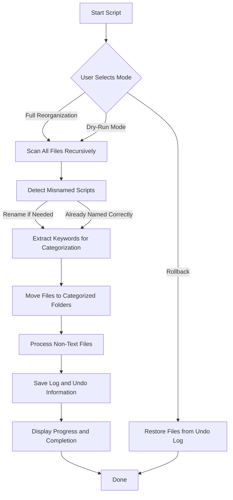

# **SCRIPT ORGANIZER - AUTO CATEGORIZATION & CLEANUP**

A Python script to rename, reorganize, and categorize your script and document library on Windows.

---

## **FEATURES**
- **Interactive Console Menu** – No command-line arguments needed.
- **Smart File Renaming** – Detects misnamed scripts and corrects their extensions.
- **Automatic Categorization** – Groups related files based on keywords.
- **Handles Non-Text Files** – Moves `.zip`, `.exe`, `.pdf`, etc., to a separate folder.
- **Rollback Feature** – Restores files to their original locations.
- **Dry-Run Mode** – Simulates changes before applying them.
- **Live Progress Tracker** – Displays last five processed files.

---

## **WORKFLOW DIAGRAM**


---

## **INSTALLATION & USAGE**
### **1. Install Dependencies**
Ensure you have Python 3.8+ installed, then run:
```bash
pip install -r requirements.txt
```
Required packages: `nltk`, `tqdm`, `sklearn`.

First-time users should download NLTK files:
```bash
python -m nltk.downloader punkt stopwords
```

---

### **2. Run the Script**
Navigate to the directory and execute:
```bash
python organize_files.py
```
The script will prompt for an operation:
```
Choose an operation:
[1] Perform a full reorganization (rename & move files)
[2] Dry-run (show changes without renaming/moving)
[3] Rollback last reorganization (restore files)
Enter choice (1, 2, or 3): _
```

#### **Option 1: Full Reorganization**
- Renames misnamed scripts (e.g., `.txt` → `.py` if detected as Python).
- Groups related files into intelligently named folders.
- Moves non-text files to a special folder (`non_text_files/`).
- Saves a log file in `logs_and_temp/`.

#### **Option 2: Dry-Run Mode**
- Simulates all operations without modifying files.
- Provides a preview before committing changes.

#### **Option 3: Rollback**
- Restores files to their original locations.
- Uses a file movement log to undo the last reorganization.

---

## **EXAMPLE DIRECTORY STRUCTURE**
### **Before Running the Script**
```
/script_library/
├── old_script.txt      (Python script misnamed)
├── random_notes.txt
├── automation.sh
├── report.md
├── temp.js
├── project/
│   ├── temp_file.txt
│   ├── old_code.txt   (PowerShell script misnamed)
```

### **After Running the Script**
```
/script_library/
├── organized_library/
│   ├── python_scripts/
│   │   ├── data_processing_1a2b3c4d.py  (Renamed from old_script.txt)
│   ├── shell_scripts/
│   │   ├── automation_script_5d6e7f8g.sh
│   ├── powershell_scripts/
│   │   ├── system_admin_9h0i1j2k.ps1  (Renamed from old_code.txt)
│   ├── miscellaneous/
│   │   ├── random_notes_3l4m5n6o.txt
│   ├── javascript_files/
│   │   ├── web_script_a7b8c9d0.js
│   ├── markdown_reports/
│   │   ├── project_summary_5e6f7g8h.md
│   ├── non_text_files/
│   │   ├── some_archive.zip
│   │   ├── installation.exe
│
├── logs_and_temp/
│   ├── file_reorganization.log
│   ├── file_movement_log.json (For rollback)
```

---

## **CONFIGURATION**
You can customize the source directory inside the script:
```python
SOURCE_DIR = r"C:\Users\YourUsername\Documents\script_library"
```
- **Organized files** go to `organized_library/`
- **Non-text files** go to `non_text_files/`
- **Logs & Undo Data** are stored in `logs_and_temp/`

---

## **LOGS & UNDO MECHANISM**
The script logs all actions:
- `file_reorganization.log` → Tracks all renames & moves.
- `file_movement_log.json` → Stores original file locations for rollback.

To restore files, run:
```bash
python organize_files.py
```
Then select **option 3** to undo the last operation.

---

## **FUTURE ENHANCEMENTS**
- **Graphical User Interface (GUI)** for better user interaction.
- **Support for additional script types** (Ruby, PHP, SQL).
- **Custom naming rules** based on user preferences.

---

## **LICENSE**
This project is open-source and available under the **MIT License**.

---

## **CONTRIBUTIONS & SUPPORT**
- Report issues or suggest features via GitHub.
- Contributions are welcome via pull requests.

---

## **ADDITIONAL NOTES**
This script is optimized for **Windows environments**, ensuring:
- Correct handling of Windows file paths.
- Avoidance of reserved filenames (`COM1`, `NUL`, etc.).
- Proper UTF-8 encoding support.

---

## **GET STARTED**
Run the script and organize your files efficiently.

Contact
Author: jm@cloudware.host

```bash
python organize_files.py
```
